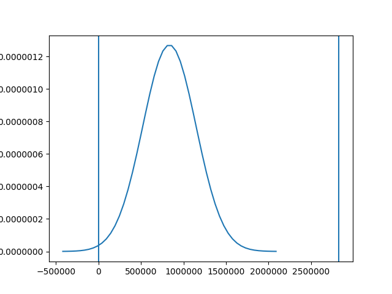
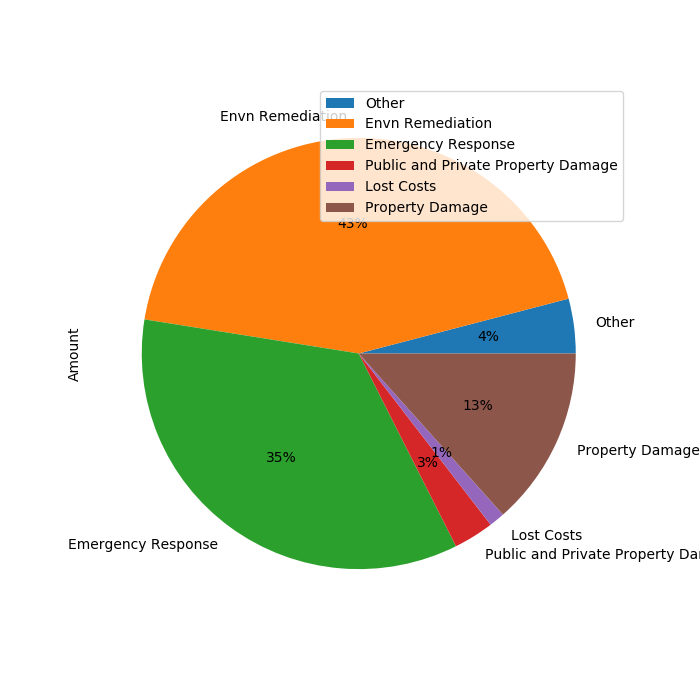
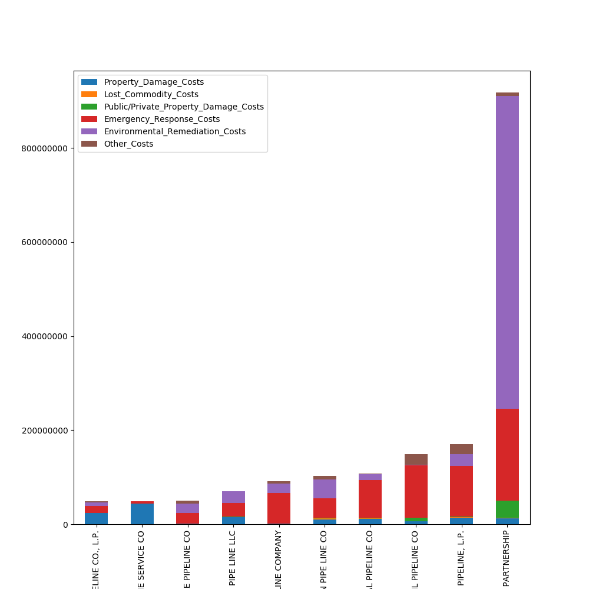
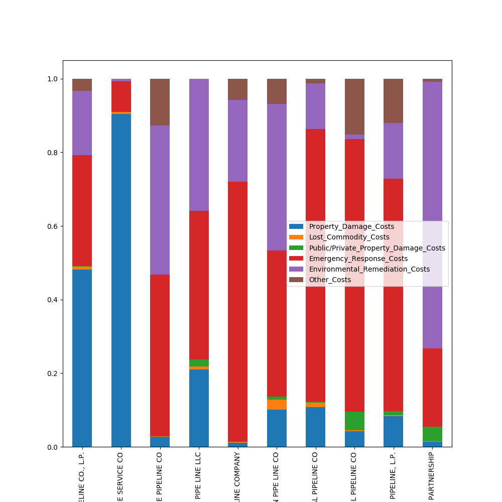

# Pipeline Case Study

### Team Members
- Troy Kayne
- Ryan Holway
- Kevin Handel

## Goals
- Find Correlations between specific columns
- Make plots that represent data in significant ways

## Group roles
- We all took a simple approach of finding patterns in the data
- Git workflow of creating our own branches and collaborating
- Discuss solutions from what we noticed

## What we did
Started with an attempt on making a normal distribution of All Costs.

We questioned the breakdown of costs among overall population.

<!-- Pie chart here -->

The Environmental Remediation and Emergency Response have the highest percentages.

Here is a visualization of the top 10 big spending companies

<!-- big_spenders2.png -->

Based off of this, it is hard to compare company to company. We decided to normalize our data to get a better visualization of the cost data.

<!-- big_spenders.png -->

## What we learned
- We learned how to loop through desired columns and normalize the data by re-assigning them
- We used the `pandas.DataFrame.filter()` method to quickly observe specific columns
- We first used `pandas.DataFrame.corr()` method to find relationships between the data columns. Thats how we got the idea to look at the costs columns

## Future Improvements
- Conduct Hypothesis testing on overall population vs company
- Conduct Hypothesis testing on company vs company and check for significant differences
- Find the probability that top spending companies pay x amount
- Fix axes and legend customization
