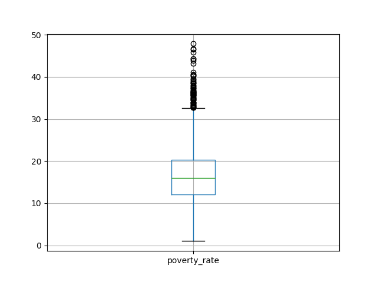
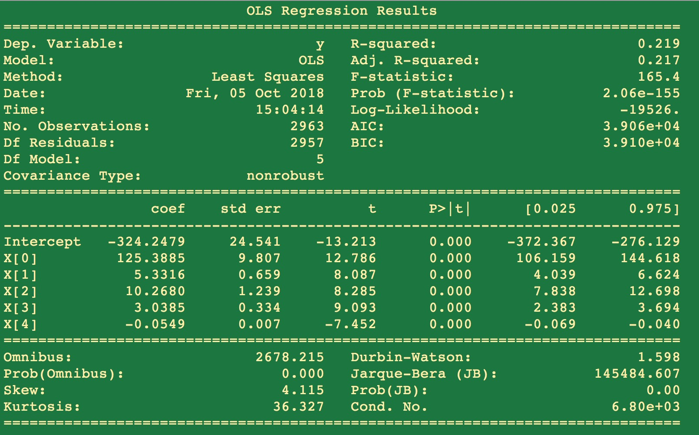
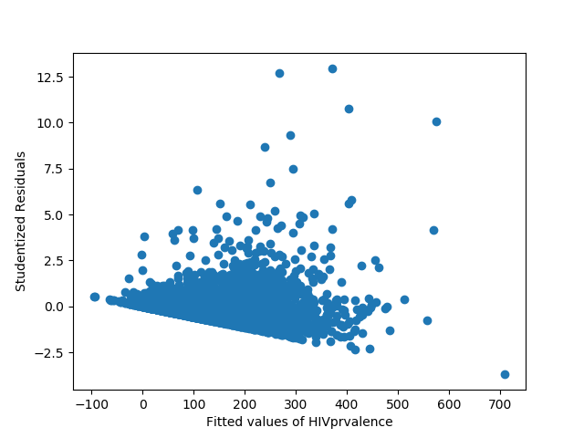
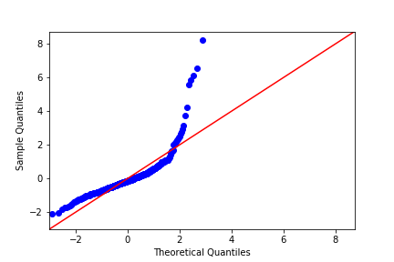
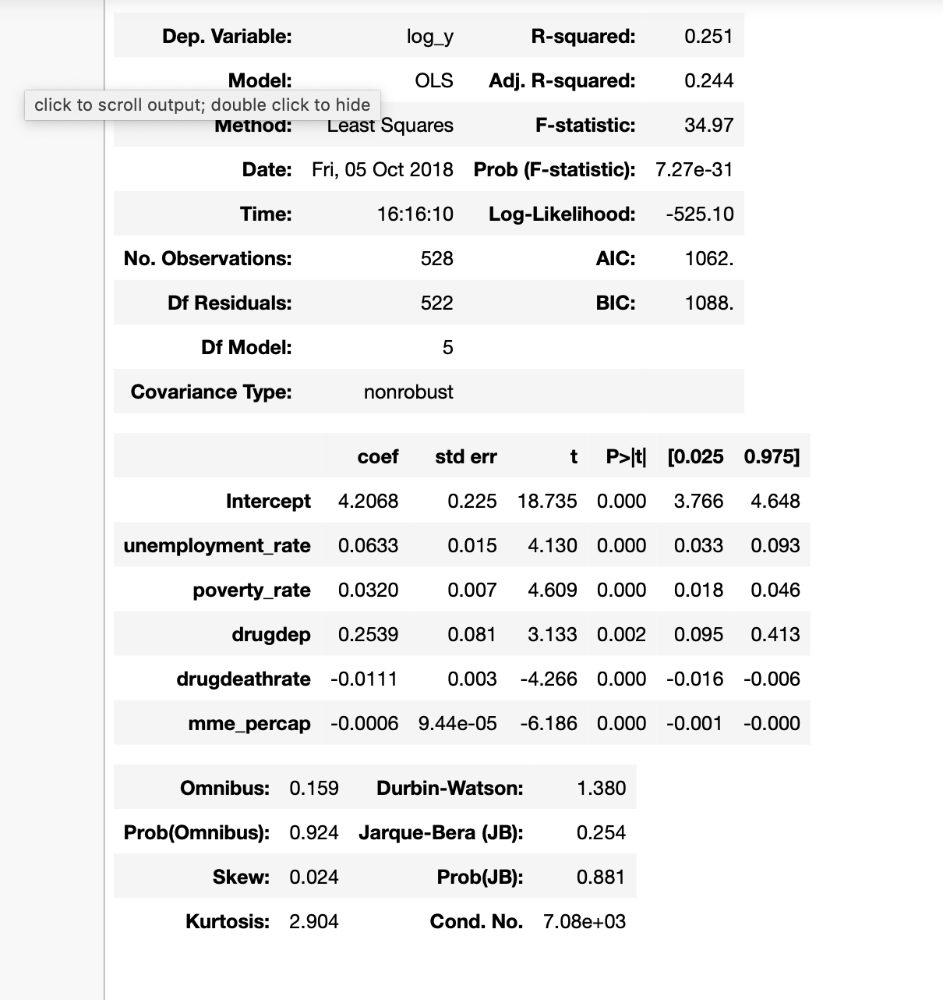
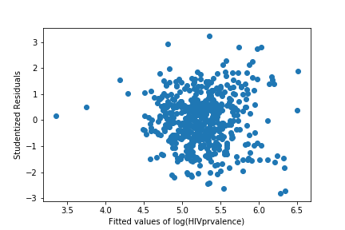
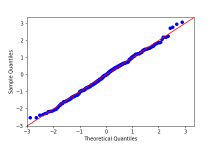

# Forecasting-HIV-Infections Case Study

### Case Study Goal:
 - To accurately model HIV incidences (new infections per 100,000) in US counties by building a linear regression model that utilizes HIV infection data, census data, data on the opioid crisis, and data on sexual orientation.

 - Identify features that are the most significant drivers of HIV infection rates and learn how these drivers differ between different regions.

### Organization:

 - Upload data and perform EDA
 - Set target as 'prevalence'
 - Write models to see affects of different features

### Description of problem and data:

 - Problem: optimizing features

 - Target: 'HIVprevalence'
 - Features: Drug dependency, poverty, morphine milligram equivalents per capita, rate, unemployment rate, drug death rate

### Accomplished

 - Ran scatter_matrix and reviewed correlation coefficients to identify strong correlates of target

 - Built model

##### Poverty Rate Box Plot

##### Drug Dependency Box Plot

##### HIV Prevalence Box Plot

##### Methadone Milligram per Capita Box Plot

##### OLS Model Summary Results

##### Scatter Plot of Residuals

##### QQ Plot of Residuals

### After taking the log of the target we found better results

##### OLS Model Summary Results

##### Scatter Plot of Residuals

##### QQ Plot of Residuals

### Learning Lessons

 - EDA takes time
 - Try new things
